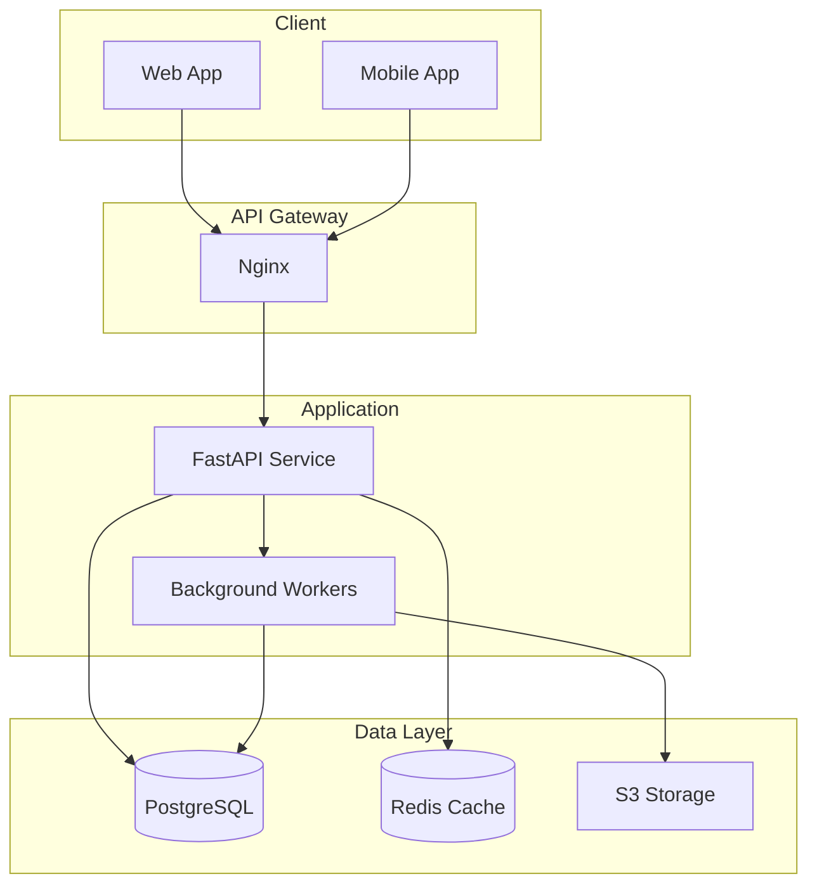

# FastAPI Microservice


> A high-performance REST API microservice built with FastAPI, featuring async database operations, JWT authentication, and comprehensive test coverage.

[Live Demo](https://api.example.com) | [API Docs](https://api.example.com/docs) | [Report Bug](https://github.com/user/repo/issues)

---

## Table of Contents

- [Features](#features)
- [Tech Stack](#tech-stack)
- [Architecture](#architecture)
- [Project Structure](#project-structure)
- [Prerequisites](#prerequisites)
- [Getting Started](#getting-started)
- [Configuration](#configuration)
- [API Reference](#api-reference)
- [Testing](#testing)
- [Deployment](#deployment)
- [Contributing](#contributing)
- [License](#license)

---

## Features

- **RESTful API** - Clean REST endpoints following OpenAPI 3.0 specification
- **Async Operations** - Non-blocking database queries with SQLAlchemy 2.0
- **JWT Authentication** - Secure token-based authentication with refresh tokens
- **Rate Limiting** - Request throttling with Redis backend
- **Auto Documentation** - Interactive Swagger UI and ReDoc
- **Health Checks** - Kubernetes-ready liveness and readiness probes
- **Structured Logging** - JSON logging with correlation IDs

---

## Tech Stack

| Layer | Technology | Version |
|-------|------------|---------|
| **Runtime** | Python | 3.12 |
| **Framework** | FastAPI | 0.109 |
| **ORM** | SQLAlchemy | 2.0 |
| **Database** | PostgreSQL | 16 |
| **Cache** | Redis | 7.2 |
| **Validation** | Pydantic | 2.5 |
| **Testing** | Pytest | 8.0 |
| **Container** | Docker | 24 |

---

## Architecture



---

## Project Structure

```
fastapi-microservice/
├── src/
│   ├── api/
│   │   ├── v1/
│   │   │   ├── endpoints/
│   │   │   │   ├── users.py
│   │   │   │   ├── items.py
│   │   │   │   └── auth.py
│   │   │   └── router.py
│   │   └── deps.py
│   ├── core/
│   │   ├── config.py
│   │   ├── security.py
│   │   └── logging.py
│   ├── models/
│   │   ├── user.py
│   │   └── item.py
│   ├── schemas/
│   │   ├── user.py
│   │   └── item.py
│   ├── services/
│   │   ├── user_service.py
│   │   └── item_service.py
│   └── main.py
├── tests/
│   ├── unit/
│   ├── integration/
│   └── conftest.py
├── alembic/
│   └── versions/
├── docker/
│   ├── Dockerfile
│   └── docker-compose.yml
├── .github/
│   └── workflows/
│       └── ci.yml
├── .env.example
├── pyproject.toml
├── requirements.txt
└── README.md
```

---

## Prerequisites

Before you begin, ensure you have the following installed:

- [Python](https://python.org/) 3.12 or higher
- [PostgreSQL](https://postgresql.org/) 16 or higher
- [Redis](https://redis.io/) 7.0 or higher
- [Docker](https://docker.com/) (optional, for containerized deployment)

---

## Getting Started

### 1. Clone the repository

```bash
git clone https://github.com/user/fastapi-microservice.git
cd fastapi-microservice
```

### 2. Create virtual environment

```bash
python -m venv venv
source venv/bin/activate  # On Windows: venv\Scripts\activate
```

### 3. Install dependencies

```bash
pip install -r requirements.txt
```

### 4. Configure environment

```bash
cp .env.example .env
# Edit .env with your database credentials
```

### 5. Run database migrations

```bash
alembic upgrade head
```

### 6. Start the application

```bash
uvicorn src.main:app --reload --port 8000
```

### 7. Access the API

- API: http://localhost:8000
- Swagger UI: http://localhost:8000/docs
- ReDoc: http://localhost:8000/redoc

---

## Configuration

| Variable | Description | Default | Required |
|----------|-------------|---------|----------|
| `DATABASE_URL` | PostgreSQL connection string | - | Yes |
| `REDIS_URL` | Redis connection string | `redis://localhost:6379` | No |
| `SECRET_KEY` | JWT signing key | - | Yes |
| `ACCESS_TOKEN_EXPIRE_MINUTES` | Token expiration time | `30` | No |
| `CORS_ORIGINS` | Allowed CORS origins | `["*"]` | No |
| `LOG_LEVEL` | Logging level | `INFO` | No |

---

## API Reference

### Authentication

#### Login

```http
POST /api/v1/auth/login
Content-Type: application/json

{
  "email": "user@example.com",
  "password": "secretpassword"
}
```

**Response:**

```json
{
  "access_token": "eyJ0eXAiOiJKV1QiLCJhbGciOiJIUzI1NiJ9...",
  "token_type": "bearer",
  "expires_in": 1800
}
```

### Users

| Method | Endpoint | Description |
|--------|----------|-------------|
| `GET` | `/api/v1/users` | List all users |
| `GET` | `/api/v1/users/{id}` | Get user by ID |
| `POST` | `/api/v1/users` | Create new user |
| `PUT` | `/api/v1/users/{id}` | Update user |
| `DELETE` | `/api/v1/users/{id}` | Delete user |

---

## Testing

```bash
# Run all tests
pytest

# Run with coverage
pytest --cov=src --cov-report=html

# Run specific test file
pytest tests/unit/test_users.py

# Run with verbose output
pytest -v
```

---

## Deployment

### Docker

```bash
# Build the image
docker build -t fastapi-microservice .

# Run the container
docker run -p 8000:8000 --env-file .env fastapi-microservice
```

### Docker Compose

```bash
docker-compose up -d
```

### Kubernetes

```bash
kubectl apply -f k8s/
```

---

## Live Demo

API Documentation: [https://api.example.com/docs](https://api.example.com/docs)

### Test Credentials

```
Email: demo@example.com
Password: demo123
```

---

## Contributing

1. Fork the repository
2. Create your feature branch (`git checkout -b feature/amazing-feature`)
3. Commit your changes (`git commit -m 'Add amazing feature'`)
4. Push to the branch (`git push origin feature/amazing-feature`)
5. Open a Pull Request

Please read [CONTRIBUTING.md](CONTRIBUTING.md) for details on our code of conduct and development process.

---

## License

This project is licensed under the MIT License - see the [LICENSE](LICENSE) file for details.

---

## Acknowledgments

- [FastAPI](https://fastapi.tiangolo.com/) - Modern Python web framework
- [SQLAlchemy](https://sqlalchemy.org/) - SQL toolkit and ORM
- [Pydantic](https://pydantic.dev/) - Data validation library
- [Uvicorn](https://uvicorn.org/) - ASGI server

---

<p align="center">Made with FastAPI</p>
