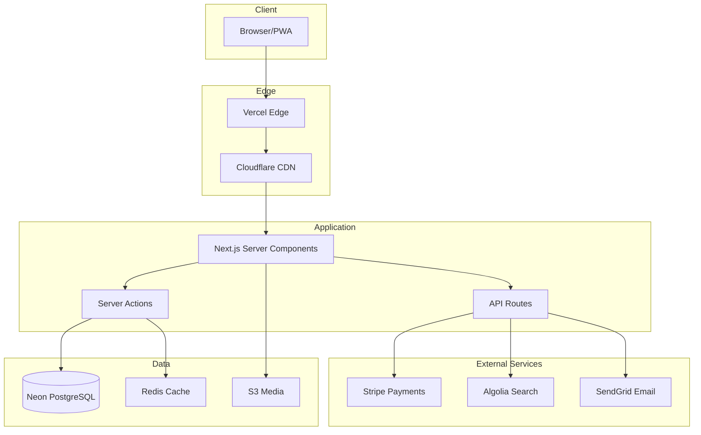

# Next.js E-Commerce Platform


> A modern, full-featured e-commerce platform built with Next.js 14, featuring server components, edge functions, and real-time inventory updates.

[Live Demo](https://shop.example.com) | [Documentation](https://docs.example.com) | [Report Bug](https://github.com/user/repo/issues)

---

## Features

- **App Router** - Leveraging Next.js 14 app directory with server components
- **Real-time Updates** - Live inventory and price updates via WebSockets
- **Edge Functions** - Geolocation-based pricing and content
- **Optimistic UI** - Instant cart updates with background sync
- **Image Optimization** - Automatic WebP conversion and lazy loading
- **SEO Ready** - Dynamic meta tags and structured data
- **PWA Support** - Installable with offline capabilities
- **Internationalization** - Multi-language support (10+ locales)

---

## Tech Stack

| Category | Technology |
|----------|------------|
| **Framework** | Next.js 14 (App Router) |
| **Language** | TypeScript 5.3 |
| **Styling** | Tailwind CSS 3.4, Radix UI |
| **State** | Zustand, TanStack Query |
| **Database** | PostgreSQL (Neon) |
| **ORM** | Prisma 5 |
| **Auth** | NextAuth.js 5 |
| **Payments** | Stripe |
| **Search** | Algolia |
| **CDN** | Cloudflare Images |
| **Hosting** | Vercel |

---

## Architecture



---

## Project Structure

```
nextjs-ecommerce/
├── app/
│   ├── (shop)/
│   │   ├── page.tsx              # Home page
│   │   ├── products/
│   │   │   ├── page.tsx          # Product listing
│   │   │   └── [slug]/page.tsx   # Product detail
│   │   ├── cart/page.tsx         # Shopping cart
│   │   └── checkout/page.tsx     # Checkout flow
│   ├── (auth)/
│   │   ├── login/page.tsx
│   │   └── register/page.tsx
│   ├── api/
│   │   ├── products/route.ts
│   │   ├── cart/route.ts
│   │   └── webhooks/stripe/route.ts
│   ├── layout.tsx
│   └── globals.css
├── components/
│   ├── ui/                       # Radix UI components
│   ├── product/
│   ├── cart/
│   └── checkout/
├── lib/
│   ├── db.ts                     # Prisma client
│   ├── auth.ts                   # NextAuth config
│   └── stripe.ts                 # Stripe client
├── hooks/
├── stores/                       # Zustand stores
├── prisma/
│   └── schema.prisma
├── public/
├── next.config.js
├── tailwind.config.ts
├── tsconfig.json
└── package.json
```

---

## Prerequisites

- [Node.js](https://nodejs.org/) 20.x or higher
- [pnpm](https://pnpm.io/) 8.x (recommended) or npm
- [PostgreSQL](https://postgresql.org/) 16 (or Neon account)
- [Stripe](https://stripe.com/) account for payments

---

## Getting Started

### 1. Clone the repository

```bash
git clone https://github.com/user/nextjs-ecommerce.git
cd nextjs-ecommerce
```

### 2. Install dependencies

```bash
pnpm install
```

### 3. Configure environment

```bash
cp .env.example .env.local
```

Edit `.env.local` with your credentials:

```env
DATABASE_URL="postgresql://..."
NEXTAUTH_SECRET="your-secret"
STRIPE_SECRET_KEY="sk_test_..."
STRIPE_WEBHOOK_SECRET="whsec_..."
```

### 4. Set up the database

```bash
pnpm prisma db push
pnpm prisma db seed
```

### 5. Start development server

```bash
pnpm dev
```

Open [http://localhost:3000](http://localhost:3000) in your browser.

---

## Configuration

| Variable | Description | Required |
|----------|-------------|----------|
| `DATABASE_URL` | PostgreSQL connection string | Yes |
| `NEXTAUTH_URL` | Application URL | Yes |
| `NEXTAUTH_SECRET` | Auth encryption key | Yes |
| `STRIPE_SECRET_KEY` | Stripe API secret key | Yes |
| `STRIPE_WEBHOOK_SECRET` | Stripe webhook signing secret | Yes |
| `ALGOLIA_APP_ID` | Algolia application ID | No |
| `ALGOLIA_SEARCH_KEY` | Algolia search-only API key | No |
| `CLOUDFLARE_ACCOUNT_ID` | Cloudflare Images account | No |

---

## Testing

```bash
# Run unit tests
pnpm test

# Run e2e tests
pnpm test:e2e

# Run with coverage
pnpm test:coverage
```

---

## Deployment

### Vercel (Recommended)

[](https://vercel.com/new/clone?repository-url=https://github.com/user/nextjs-ecommerce)

### Manual Deployment

```bash
pnpm build
pnpm start
```

---

## Live Demo

Visit the live demo at [https://shop.example.com](https://shop.example.com)

### Demo Account
- Email: `demo@example.com`
- Password: `demo123`

### Test Card (Stripe)
- Number: `4242 4242 4242 4242`
- Expiry: Any future date
- CVC: Any 3 digits

---

## Contributing

1. Fork the repository
2. Create your feature branch (`git checkout -b feature/amazing-feature`)
3. Commit your changes (`git commit -m 'Add amazing feature'`)
4. Push to the branch (`git push origin feature/amazing-feature`)
5. Open a Pull Request

---

## License

MIT License - see [LICENSE](LICENSE) for details.

---

## Acknowledgments

- [Next.js](https://nextjs.org/) - React framework
- [Tailwind CSS](https://tailwindcss.com/) - Utility-first CSS
- [Radix UI](https://radix-ui.com/) - Accessible components
- [Stripe](https://stripe.com/) - Payment processing
- [Vercel](https://vercel.com/) - Hosting platform

---

<p align="center">Built with Next.js</p>
