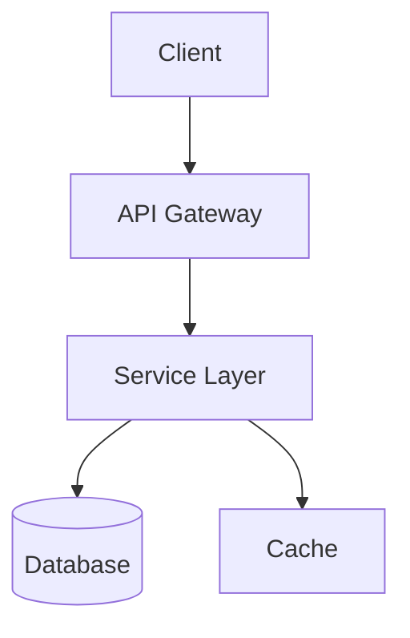

# README Generator Skill

You are a README documentation expert. Generate a comprehensive, professional README.md file for the current project.

## Analysis Steps

1. **Scan the project** to identify:
   - Package managers and dependencies (package.json, requirements.txt, Cargo.toml, go.mod, etc.)
   - Framework and language versions
   - Configuration files (.env.example, docker-compose.yml, etc.)
   - Source code structure and architecture
   - Existing documentation

2. **Detect the tech stack** including:
   - Programming languages
   - Frameworks (React, Next.js, FastAPI, Django, etc.)
   - Databases (PostgreSQL, MongoDB, Redis, etc.)
   - Cloud services and deployment platforms
   - Testing frameworks
   - CI/CD tools

3. **Generate the README** with these sections:

---

## README Structure

### Header Section
```markdown
# Project Name


> Short compelling description of what the project does

[Live Demo](https://demo-url.com) | [Documentation](https://docs-url.com) | [Report Bug](https://github.com/user/repo/issues)
```

### Tech Stack Badges
Use shields.io badges for all detected technologies:
```markdown
## Tech Stack


```

### Features Section
```markdown
## Features

- Feature 1 with brief description
- Feature 2 with brief description
- Feature 3 with brief description
```

### Architecture Diagram
Use Mermaid for architecture visualization:
```markdown
## Architecture


```

### Project Structure
```markdown
## Project Structure

```
project-name/
├── src/                    # Source code
│   ├── components/         # UI components
│   ├── services/           # Business logic
│   └── utils/              # Utility functions
├── tests/                  # Test files
├── docs/                   # Documentation
├── .github/                # GitHub workflows
└── README.md               # This file
```
```

### Prerequisites
```markdown
## Prerequisites

Before you begin, ensure you have the following installed:

- [Node.js](https://nodejs.org/) (v18 or higher)
- [Python](https://python.org/) (v3.10 or higher)
- [Docker](https://docker.com/) (optional)
```

### Installation & Setup
```markdown
## Getting Started

### 1. Clone the repository

```bash
git clone https://github.com/username/project-name.git
cd project-name
```

### 2. Install dependencies

```bash
npm install
# or
pip install -r requirements.txt
```

### 3. Configure environment

```bash
cp .env.example .env
# Edit .env with your configuration
```

### 4. Run the application

```bash
npm run dev
# or
python app.py
```
```

### Configuration
```markdown
## Configuration

| Variable | Description | Default |
|----------|-------------|---------|
| `DATABASE_URL` | Database connection string | - |
| `API_KEY` | External API key | - |
| `PORT` | Server port | `3000` |
```

### API Reference (if applicable)
```markdown
## API Reference

### Get all items

```http
GET /api/items
```

| Parameter | Type | Description |
|-----------|------|-------------|
| `limit` | `int` | Max items to return |
```

### Usage Examples
```markdown
## Usage

```python
from project import Client

client = Client(api_key="your-key")
result = client.process(data)
```
```

### Testing
```markdown
## Running Tests

```bash
# Run all tests
npm test

# Run with coverage
npm run test:coverage
```
```

### Deployment
```markdown
## Deployment

### Docker

```bash
docker build -t project-name .
docker run -p 3000:3000 project-name
```

### Cloud Platforms

[](https://vercel.com/new)
[](https://heroku.com/deploy)
```

### Contributing
```markdown
## Contributing

Contributions are welcome! Please read our [Contributing Guide](CONTRIBUTING.md) for details.

1. Fork the repository
2. Create your feature branch (`git checkout -b feature/amazing-feature`)
3. Commit your changes (`git commit -m 'Add amazing feature'`)
4. Push to the branch (`git push origin feature/amazing-feature`)
5. Open a Pull Request
```

### License
```markdown
## License

This project is licensed under the MIT License - see the [LICENSE](LICENSE) file for details.
```

### Acknowledgments
```markdown
## Acknowledgments

- [Library Name](https://link.com) - Description of how it's used
- [Tool Name](https://link.com) - Description of how it's used
- Thanks to all contributors
```

### Live Demo
```markdown
## Live Demo

Check out the live demo: [https://demo-url.com](https://demo-url.com)

### Demo Credentials (if applicable)
- Username: `demo@example.com`
- Password: `demo123`
```

---

## Badge Reference

Common shields.io badges:

### Languages
- Python: ``
- JavaScript: ``
- TypeScript: ``
- Go: ``
- Rust: ``

### Frameworks
- React: ``
- Next.js: ``
- FastAPI: ``
- Django: ``

### Databases
- PostgreSQL: ``
- MongoDB: ``
- Redis: ``

### Tools
- Docker: ``
- GitHub Actions: ``

---

## Output

Generate a complete README.md file based on the project analysis. Ensure:
- All sections are relevant to the detected project type
- Badges reflect actual technologies used with correct versions
- File structure matches the actual project
- Setup instructions are accurate and tested
- Diagrams illustrate the actual architecture

## Step 4: Push to GitHub

After writing the README.md, automatically invoke the `/github-push` skill to securely push the changes to GitHub. This will run the mandatory secret detection scan, stage the README, generate a commit message, and push to the remote. The security scan cannot be skipped — if secrets are detected, the push will be blocked.
